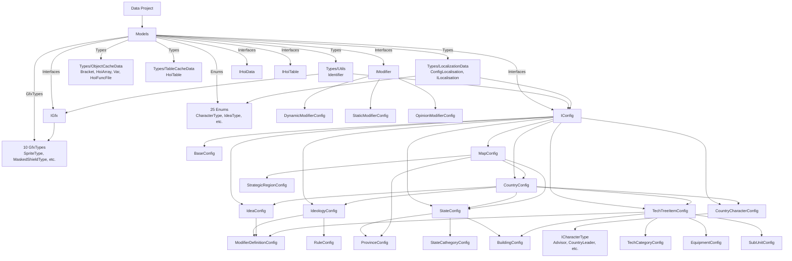
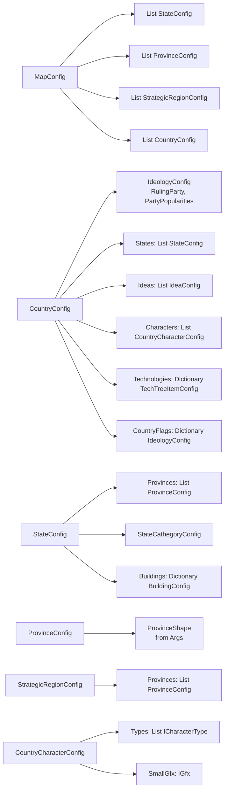
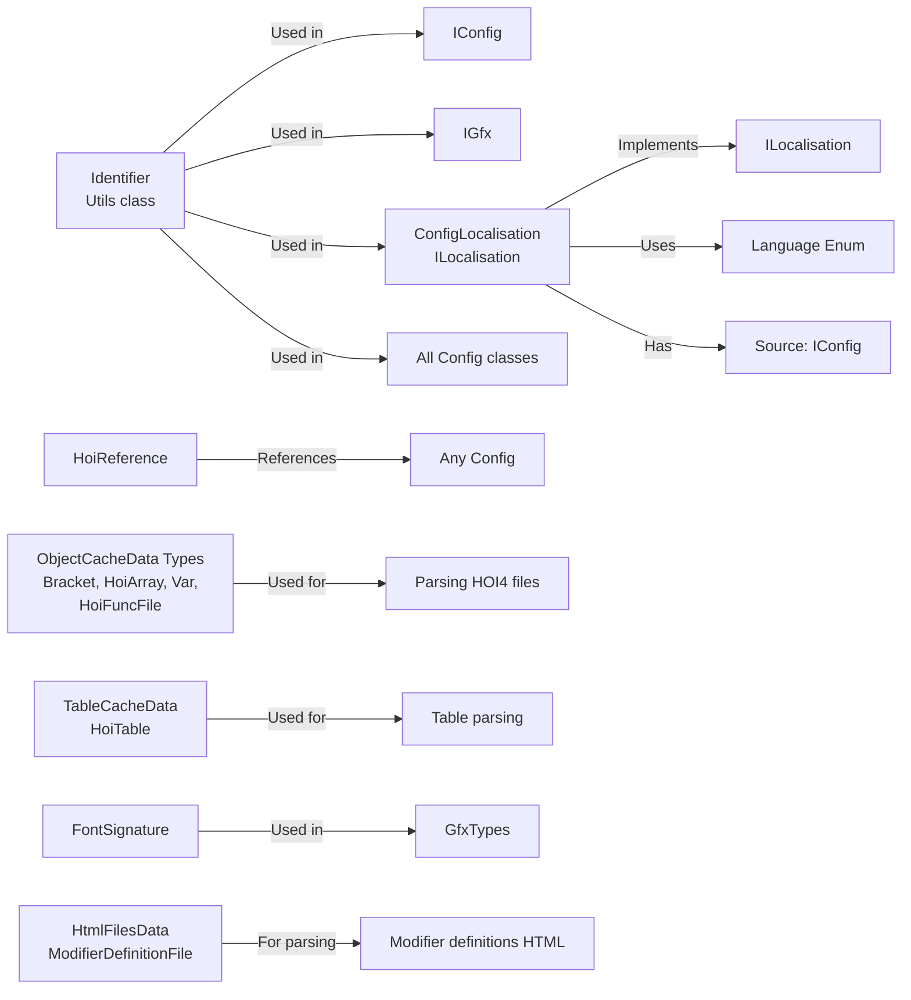
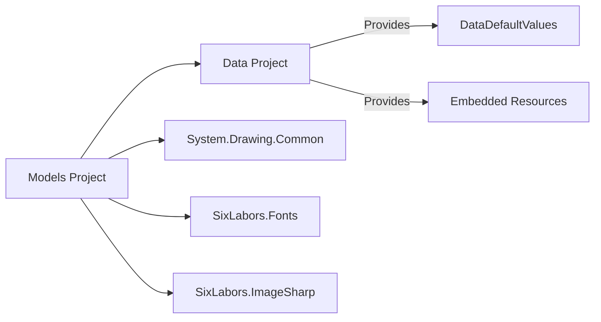

# Визуализация зависимостей проекта Models

## Общая структура зависимостей

## Иерархия интерфейсов и базовых классов

```mermaid
graph TD
    IConfig[IConfig Interface<br/>Id: Identifier<br/>Localisation: ConfigLocalisation<br/>Gfx: IGfx]
    
    IConfig --> BaseConfig[BaseConfig<br/>Base implementation]
    IConfig --> CountryConfig[CountryConfig]
    IConfig --> StateConfig[StateConfig]
    IConfig --> IdeaConfig[IdeaConfig]
    IConfig --> IdeologyConfig[IdeologyConfig]
    IConfig --> TechTreeItemConfig[TechTreeItemConfig]
    IConfig --> CountryCharacterConfig[CountryCharacterConfig]
    IConfig --> MapConfig[MapConfig]
    IConfig --> ProvinceConfig[ProvinceConfig]
    IConfig --> EquipmentConfig[EquipmentConfig]
    IConfig --> BuildingConfig[BuildingConfig]
    IConfig --> SubUnitConfig[SubUnitConfig]
    IConfig --> TechCategoryConfig[TechCategoryConfig]
    IConfig --> IdeaSlotConfig[IdeaSlotConfig]
    IConfig --> IdeaTagConfig[IdeaTagConfig]
    IConfig --> StateCathegoryConfig[StateCathegoryConfig]
    IConfig --> StrategicRegionConfig[StrategicRegionConfig]
    IConfig --> SubUnitGroupConfig[SubUnitGroupConfig]
    IConfig --> SubUnitCategoryConfig[SubUnitCategoryConfig]
    IConfig --> RuleConfig[RuleConfig]
    IConfig --> ModifierDefinitionConfig[ModifierDefinitionConfig]
    IConfig --> TriggerDefenitionConfig[TriggerDefenitionConfig]
    IConfig --> TemplateConfig[TemplateConfig]
    IConfig --> SupereventConfig[SupereventConfig]
    IConfig --> CharacterTraitConfig[CharacterTraitConfig]
    IConfig --> TechTreeConfig[TechTreeConfig]
    
    IConfig --> ICharacterType[ICharacterType : IConfig]
    ICharacterType --> AdvisorCharacterType[AdvisorCharacterType]
    ICharacterType --> CountryLeaderCharacterType[CountryLeaderCharacterType]
    ICharacterType --> CorpsCommanderCharacterType[CorpsCommanderCharacterType]
    ICharacterType --> FieldMarshalCharacterType[FieldMarshalCharacterType]
    ICharacterType --> NavalLeaderCharacterType[NavalLeaderCharacterType]
    
    IGfx[IGfx Interface<br/>Id: Identifier<br/>Content: Bitmap] --> SpriteType[SpriteType]
    IGfx --> MaskedShieldType[MaskedShieldType]
    IGfx --> ProgressbarType[ProgressbarType]
    IGfx --> TextSpriteType[TextSpriteType]
    IGfx --> FrameAnimatedSpriteType[FrameAnimatedSpriteType]
    IGfx --> LineChartType[LineChartType]
    IGfx --> CorneredTileSpriteType[CorneredTileSpriteType]
    IGfx --> PieChartType[PieChartType]
    IGfx --> CircularProgressBarType[CircularProgressBarType]
    IGfx --> ArrowType[ArrowType]
    
    IModifier[IModifier Interface] --> DynamicModifierConfig
    IModifier --> StaticModifierConfig[StaticModifierConfig]
    IModifier --> OpinionModifierConfig[OpinionModifierConfig]
```

## Зависимости конфигураций стран и карты

## Зависимости технологий и модификаторов

```mermaid
graph TD
    TechTreeItemConfig --> Categories[Categories: List TechCategoryConfig]
    TechTreeItemConfig --> EnableBuildings[EnableBuildings: Dictionary BuildingConfig]
    TechTreeItemConfig --> EnableEquipments[EnableEquipments: List EquipmentConfig]
    TechTreeItemConfig --> EnableUnits[EnableUnits: List SubUnitConfig]
    TechTreeItemConfig --> Modifiers[Modifiers: Dictionary ModifierDefinitionConfig]
    TechTreeItemConfig --> Dependencies[Dependencies: Dictionary TechTreeItemConfig]
    TechTreeItemConfig --> ChildOf[ChildOf: List TechTreeItemConfig]
    TechTreeItemConfig --> Mutual[Mutual: List TechTreeItemConfig]
    
    TechTreeConfig --> Items[TechTreeItems: List TechTreeItemConfig]
    
    IdeologyConfig --> Rules[Rules: Dictionary RuleConfig]
    IdeologyConfig --> Modifiers2[Modifiers: Dictionary ModifierDefinitionConfig]
    IdeologyConfig --> FactionModifiers[FactionModifiers: Dictionary ModifierDefinitionConfig]
    IdeologyConfig --> SubTypes[SubTypes: List IdeologyType]
    
    IdeaConfig --> Modifiers3[Modifiers: Dictionary ModifierDefinitionConfig]
    IdeaConfig --> Tag[Tag: IdeaTagConfig]
    
    ModifierDefinitionConfig --> |"Used by"| IdeologyConfig
    ModifierDefinitionConfig --> |"Used by"| IdeaConfig
    ModifierDefinitionConfig --> |"Used by"| TechTreeItemConfig
    ModifierDefinitionConfig --> |"Used by"| DynamicModifierConfig
    ModifierDefinitionConfig --> |"Used by"| StaticModifierConfig
    ModifierDefinitionConfig --> |"Used by"| OpinionModifierConfig
```

## Типы и утилиты

## Граф зависимостей ModConfig (центральная модель)

```mermaid
graph TD
    ModConfig[ModConfig<br/>Central container] --> Rules[List RuleConfig]
    ModConfig --> StateCategories[List StateCathegoryConfig]
    ModConfig --> Regiments[List SubUnitConfig]
    ModConfig --> Countries[List CountryConfig]
    ModConfig --> Ideas[List IdeaConfig]
    ModConfig --> TriggerDefinitions[List TriggerDefenitionConfig]
    ModConfig --> IdeaTags[List IdeaTagConfig]
    ModConfig --> Vars[List Var]
    ModConfig --> StaticModifiers[List StaticModifierConfig]
    ModConfig --> OpinionModifiers[List OpinionModifierConfig]
    ModConfig --> DynamicModifiers[List DynamicModifierConfig]
    ModConfig --> ModifierDefinitions[List ModifierDefinitionConfig]
    ModConfig --> IdeaSlots[List IdeaSlotConfig]
    ModConfig --> Buildings[List BuildingConfig]
    ModConfig --> Gfxes[List IGfx]
    ModConfig --> TechCategories[List TechCategoryConfig]
    ModConfig --> Equipments[List EquipmentConfig]
    ModConfig --> Map[MapConfig]
    ModConfig --> TechTreeLedgers[List TechTreeConfig]
    ModConfig --> TechTreeItems[List TechTreeItemConfig]
    ModConfig --> Characters[List CountryCharacterConfig]
    ModConfig --> Ideologies[List IdeologyConfig]
    ModConfig --> CharacterTraits[List CharacterTraitConfig]
    ModConfig --> SubUnitGroups[List SubUnitGroupConfig]
    ModConfig --> SubUnitCategories[List SubUnitCategoryConfig]
```

## Внешние зависимости

## Таблица зависимостей основных классов

| Класс | Зависит от | Используется в |
|-------|------------|----------------|
| **IConfig** | Identifier, ConfigLocalisation, IGfx | Все Config классы |
| **BaseConfig** | IConfig | Базовый класс (редко используется напрямую) |
| **CountryConfig** | IConfig, IdeologyConfig, StateConfig, IdeaConfig, CountryCharacterConfig, TechTreeItemConfig | MapConfig, ModConfig |
| **StateConfig** | IConfig, ProvinceConfig, StateCathegoryConfig, BuildingConfig | MapConfig, CountryConfig |
| **MapConfig** | IConfig, StateConfig, ProvinceConfig, StrategicRegionConfig, CountryConfig | ModConfig |
| **IdeologyConfig** | IConfig, ModifierDefinitionConfig, RuleConfig | CountryConfig, ModConfig |
| **IdeaConfig** | IConfig, ModifierDefinitionConfig | CountryConfig, ModConfig |
| **TechTreeItemConfig** | IConfig, TechCategoryConfig, BuildingConfig, EquipmentConfig, SubUnitConfig, ModifierDefinitionConfig | CountryConfig, ModConfig, TechTreeConfig |
| **CountryCharacterConfig** | IConfig, ICharacterType, IGfx | CountryConfig, ModConfig |
| **IGfx** | Identifier | Все Config классы (через IConfig) |
| **GfxTypes** (10 классов) | IGfx | Все Config классы |
| **Identifier** | - | Все Config классы, IGfx, ConfigLocalisation |
| **ConfigLocalisation** | ILocalisation, Language Enum, IConfig | Все Config классы (через IConfig) |
| **ModConfig** | Все Config классы | Application layer |

## Основные паттерны зависимостей

1. **Базовая иерархия**: Все конфигурационные классы реализуют `IConfig`, который требует `Identifier`, `ConfigLocalisation` и `IGfx`

2. **Композиция**: 
   - `MapConfig` содержит коллекции других конфигов
   - `CountryConfig` содержит ссылки на другие конфиги
   - `TechTreeItemConfig` может ссылаться на другие `TechTreeItemConfig` (граф зависимостей)

3. **Модификаторы**: Все конфиги могут использовать `ModifierDefinitionConfig` через словари

4. **Графика**: Все конфиги имеют `IGfx`, который реализуется 10 различными типами из `GfxTypes`

5. **Локализация**: Все конфиги имеют `ConfigLocalisation`, который привязан к исходному конфигу

6. **Идентификация**: Все конфиги используют `Identifier` для уникальной идентификации (может быть строкой или числом)

